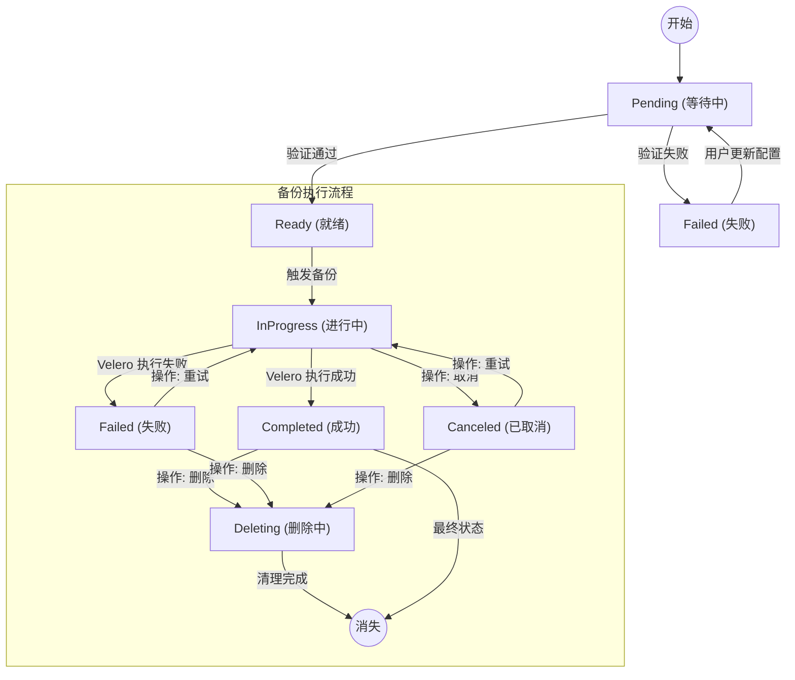

# 应用备份状态与操作规则说明

本文档基于 `disaster-server` 和 `disaster-operator` 的代码逻辑整理，旨在描述应用备份 (`AppBackup`) 的生命周期状态以及备份执行状态的流转规则。

## 1. 核心状态字段定义

### 1.1 应用备份资源状态 (Resource Status)
*   **字段路径**: `.status.status`
*   **对应代码常量**: `AppBackupPhase`
*   **含义**:
    *   `Pending` (等待中): 正在初始化，控制器正在验证集群连接及存储仓库 (BackupStorageLocation) 的可用性。
    *   `Ready` (就绪): 所有依赖验证通过，调度器已配置，可以随时执行备份任务。
    *   `Failed` (失败): 配置存在错误（例如指定集群无法连接、存储仓库不存在），无法执行备份。
    *   `Deleting` (删除中): 资源正在被删除，清理外部关联资源中。

### 1.2 备份执行状态 (Backup Execution Status)
*   **字段路径**: 
    *   最新状态: `.status.latestBackupStatus`
    *   历史记录: `.status.history[].managedStatus`
*   **对应代码常量**: `ManagedStatus`
*   **含义**:
    *   `InProgress` (进行中): 备份正在执行 (对应 Velero 状态: `New`, `InProgress`, `Finalizing`)。
    *   `Completed` (已完成): 备份成功结束 (对应 Velero 状态: `Completed`)。
    *   `Failed` (失败): 备份执行出错 (对应 Velero 状态: `Failed`, `PartiallyFailed`, `FailedValidation`)。
    *   `Canceled` (已取消): 备份被用户手动取消 (对应显式 Cancel 操作)。
    *   `Deleting` (删除中): 备份正在被删除，或已执行 Delete 操作。该状态最终会随着资源消失而从历史中清理。

---

## 2. 状态变更与操作权限表

根据用户业务逻辑，以下是不同状态下允许的操作及其触发条件：

### 2.1 全局操作：新增/自动备份

| 当前资源状态 (AppBackup Status) | 是否允许新增备份 | 逻辑说明 (结合代码) |
| :--- | :--- | :--- |
| **Ready** (就绪) | ✅ **允许** | 只有当资源处于 `Ready` 状态时，`ReadyHandler` 才会处理 `Action` 请求或触发定时任务。 |
| **Pending** (等待中) | 🚫 **禁止** | 处于 `Pending` 状态时，控制器仍在进行环境检查，会忽略所有备份触发请求。 |
| **Failed** (失败) | 🚫 **禁止** | 处于 `Failed` 状态时，必须修复配置（如集群信息）使状态变回 `Pending` -> `Ready` 后才能操作。 |

### 2.2 针对单次备份的操作 (基于最新状态)

针对列表中的最新一条备份记录 (`latestBackupStatus`)，操作规则如下：

| 最新备份状态 | 允许的操作 | 对应的 Action Type | 行为描述 |
| :--- | :--- | :--- | :--- |
| **InProgress** (进行中) | **取消 (Cancel)** | `Cancel` | 仅当备份还在运行时可以取消。Operator 会向 Velero 发送删除/停止指令。 |
| **Failed** (失败) | **重试 (Retry)** | `Retry` | 备份失败后，允许用户选择“重试”。Operator 会基于原配置重新创建一个新的备份任务。 |
| **Canceled** (已取消) | **重试 (Retry)** | `Retry` | 已取消的任务也可以选择重试。 |
| **Deleting** (删除中) | **无** | `N/A` | 资源正在删除中，操作将被忽略。记录最终会被自动清理。 |
| **Completed** (成功) | **恢复 / 下载 / 删除** | `Delete` | 允许基于此备份恢复，或删除该备份。 |

### 2.3 接口字段示例

前端通过更新 `AppBackup` 的 `.spec.action` 字段来触发上述操作：

```json
{
  "spec": {
    "action": {
      "type": "Cancel",   // 可选值: Backup (立即备份), Retry (重试), Cancel (取消), Delete (删除)
      "targetBackup": "backup-demo-20250101",  // 可选。指定目标备份名；若为空，默认操作最新的一条。
      "requestAt": "2026-01-12T12:00:00Z"      // 时间戳必须更新才会触发 Operator 处理
    }
  }
}
```

## 3. 状态流转示意图


