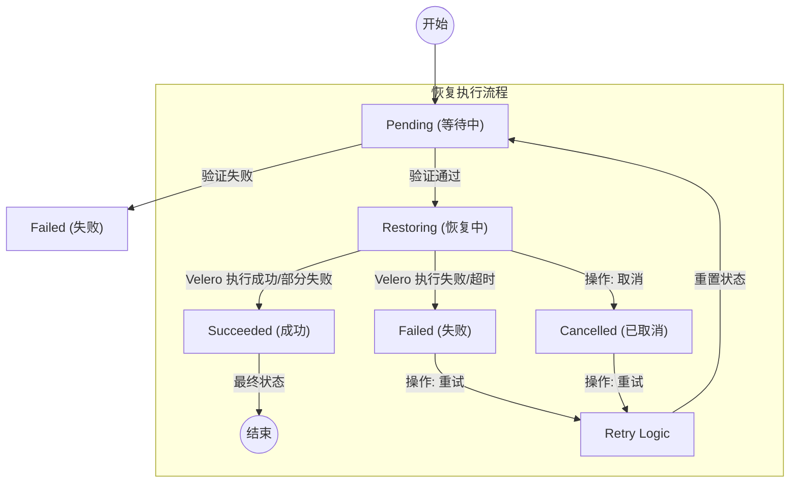

# 应用恢复状态与操作规则说明

本文档基于 `disaster-server` 和 `disaster-operator` 的代码逻辑整理，旨在描述应用恢复 (`AppRestore`) 的生命周期状态以及操作规则。

## 1. 核心状态字段定义

### 1.1 应用恢复资源状态 (Resource Status)
*   **字段路径**: `.status.status`
*   **对应代码常量**: `AppRestorePhase`
*   **含义**:
    *   `Pending` (等待中): 正在初始化，控制器正在验证集群连接、BackupStorageLocation 以及备份源 (BackupSource) 的存在性。
    *   `Restoring` (恢复中): 依赖验证通过，Velero Restore 任务正在创建或执行中 (对应 Velero 状态: `InProgress`, `New`)。
    *   `Succeeded` (成功): 恢复任务执行成功 (对应 Velero 状态: `Completed`, `PartiallyFailed`)。
        *   注：`PartiallyFailed` (部分失败) 在业务上通常视为成功，但包含部分错误。
    *   `Failed` (失败): 恢复任务执行失败 (对应 Velero 状态: `Failed`, `FailedValidation`) 或配置检查失败 (如备份源不存在)。
    *   `Cancelled` (已取消): 恢复任务被用户手动取消 (底层 Velero Restore 被删除)。
    *   `Deleting` (删除中): 资源正在被删除，清理外部关联资源中。

---

## 2. 状态变更与操作权限表

根据用户业务逻辑，以下是不同状态下允许的操作及其触发条件：

### 2.1 针对恢复任务的操作

`AppRestore` 是一次性任务（不同于 AppBackup 的长期策略），因此操作直接针对该资源本身的状态。

| 当前状态 (AppRestore Status) | 允许的操作 | 对应的 Action Type | 行为描述 |
| :--- | :--- | :--- | :--- |
| **Restoring** (恢复中) | **取消 (Cancel)** | `cancel` | 仅当任务处于 `Restoring` 状态且底层 Velero Restore 未最终结束时。Operator 会直接删除底层的 Velero Restore 资源，并将状态更新为 `Cancelled`。 |
| **Failed** (失败) | **重试 (Retry)** | `retry` | 任务失败后，允许用户选择“重试”。Operator 会删除旧的 Velero Restore (如果存在) 并重置状态为 `Pending`，触发重新调度。 |
| **Cancelled** (已取消) | **重试 (Retry)** | `retry` | 已取消的任务也可以选择重试。逻辑同上。 |
| **Succeeded** (成功) | **无** | `N/A` | 任务已成功结束，是一个终态。通常不进行额外操作，除查看日志或删除该记录。 |
| **Pending** (等待中) | **无** | `N/A` | 正在初始化中，通常持续时间很短。 |

### 2.2 接口字段示例

前端通过更新 `AppRestore` 的 `.spec.action` 字段来触发上述操作：

```json
{
  "spec": {
    "action": {
      "type": "cancel",   // 可选值: retry (重试), cancel (取消)
      "requestAt": "2026-01-12T12:00:00Z"      // 时间戳必须更新才会触发 Operator 处理
    }
  }
}
```

## 3. 状态流转示意图


